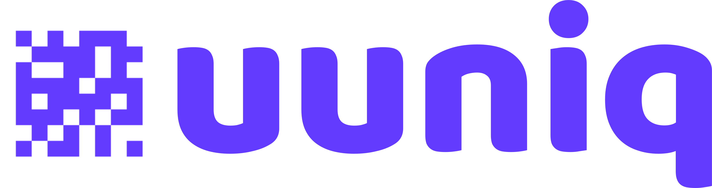

[String]: https://developer.mozilla.org/en-US/docs/Web/JavaScript/Reference/Global_Objects/String
[Number]: https://developer.mozilla.org/en-US/docs/Web/JavaScript/Reference/Global_Objects/Number
[Boolean]: https://developer.mozilla.org/en-US/docs/Web/JavaScript/Reference/Global_Objects/Boolean
[Object]: https://developer.mozilla.org/en-US/docs/Web/JavaScript/Reference/Global_Objects/Object
[Date]: https://developer.mozilla.org/en-US/docs/Web/JavaScript/Reference/Global_Objects/Date
[Buffer]: https://developer.mozilla.org/en-US/docs/Web/JavaScript/Reference/Global_Objects/ArrayBuffer
[Promise]: https://developer.mozilla.org/en-US/docs/Web/JavaScript/Reference/Global_Objects/Promise
[Void]: https://developer.mozilla.org/en-US/docs/Web/JavaScript/Reference/Global_Objects/Undefined
[Null]: https://developer.mozilla.org/en-US/docs/Web/JavaScript/Reference/Operators/null
[Undefined]: https://developer.mozilla.org/en-US/docs/Web/JavaScript/Reference/Global_Objects/Undefined

<!---->

[SnowflakeOptionsDefault]: ./src/defaults/SnowflakeOptions.default.ts
[IncrementOptionsDefault]: ./src/defaults/IncrementOptions.default.ts

<!---->

[SnowflakeOptions]: ./src/types/SnowflakeOptions.type.ts
[SnowflakeResolve]: ./src/types/SnowflakeResolve.type.ts
[IncrementOptions]: ./src/types/IncrementOptions.type.ts

<div align="center">
  <br/>
  
  <br/>
  <br/>
  
  
  
  
</div>

## Contents

- [About](#about)
- [Features](#features)
- [Installation](#installation)
- [Documentation](#documentation)
  - [Tree](#tree)
  - [Import](#import)
  - [Constructors](#constructors)
  - [Methods](#methods)
  - [Types](#types)
- [Links](#links)
  - [Discord](https://discord.gg/keift)
  - [Telegram](https://t.me/keiftt)
  - [Twitter](https://x.com/keiftttt)
  - [GitHub](https://github.com/keift)
- [License](#license)

## About

Short yet unique IDs.

## Features

- Short yet unique IDs
- The possibility of collision is impossible
- Suitable for distributed systems
- Suitable for sorting and database indexes
- Snowflake IDs can be generated, each one is timestamp based
- Increment IDs can be generated, increasing each time they are generated
- Symbolic IDs can be generated, similar to YouTube's video identities

## Installation

You can install it as follows.

```shell
# NPM
npm add uuniq

# PNPM
pnpm add uuniq

# Yarn
yarn add uuniq

# Bun
bun add uuniq

# Deno
deno add uuniq
```

## Documentation

### Tree

Briefly as follows.

```typescript
uuniq
│
├── new Snowflake(options?)
│   │
│   ├── generate()
│   └── resolve(id)
│
├── new Increment(options)
│   │
│   └── generate()
│
├── type SnowflakeOptions
├── type SnowflakeResolve
└── type IncrementOptions
```

### Import

Briefly as follows.

```typescript
import { Snowflake, Increment } from 'uuniq';
```

### Constructors

`new Snowflake(options?)`

Snowflake IDs are timestamp based identifiers. Each ID consists of numbers that are quite unique from the previous ones. Unique IDs can be generated in distributed systems by specifying Place IDs.

> | Parameter  | Type               | Default                   | Description            |
> | ---------- | ------------------ | ------------------------- | ---------------------- |
> | `options?` | [SnowflakeOptions] | [SnowflakeOptionsDefault] | Constructor's options. |
>
> Example:
>
> ```typescript
> const SnowflakeIDs = new Snowflake();
> ```

<br/>

`new Increment(options)`

Increment IDs that increase each time they are generated. Sequences are kept in the database. You can create a free database from [MongoDB Cloud](https://cloud.mongodb.com). Storing sequences requires tools that include `set(key, value)` and `get(key)`. We recommend [Keyv](https://npmjs.com/package/keyv). Sequences can be parsed by specifying Place IDs.

> | Parameter | Type               | Default                   | Description            |
> | --------- | ------------------ | ------------------------- | ---------------------- |
> | `options` | [IncrementOptions] | [IncrementOptionsDefault] | Constructor's options. |
>
> Example:
>
> ```typescript
> import Keyv from 'keyv';
> import KeyvMongo from '@keyv/mongo';
>
> const UuniqStore = new Keyv(new KeyvMongo('mongodb+srv://...@...mongodb.net/app', { collection: 'uuniq' }));
>
> const IncrementIDs = new Increment({ store: UuniqStore });
> ```

### Methods

`Snowflake.generate()`

Generate Snowflake IDs.

> | Parameter | Type | Default | Description |
> | --------- | ---- | ------- | ----------- |
> |           |      |         |             |
>
> returns [String]
>
> Example:
>
> ```typescript
> const NumericSnowflakeIDs = new Snowflake({ format: 'numeric', place_id: 0 });
> const SymbolicSnowflakeIDs = new Snowflake({ format: 'symbolic', place_id: 1 });
>
> NumericSnowflakeIDs.generate(); // "102604921389056"
> NumericSnowflakeIDs.generate(); // "102604921389057"
>
> SymbolicSnowflakeIDs.generate(); // "T8Qu56ki"
> SymbolicSnowflakeIDs.generate(); // "T8Qu56kj"
> ```

<br/>

`Snowflake.resolve(id)`

Resolve the previously generated Snowflake ID. For this, the `format`, `epoch` and `place_id` values ​​in the Constructor must be correct.

> | Parameter | Type     | Default | Description        |
> | --------- | -------- | ------- | ------------------ |
> | `id`      | [String] |         | ID to be resolved. |
>
> returns [SnowflakeResolve]
>
> Example:
>
> ```typescript
> const NumericSnowflakeIDs = new Snowflake({ format: 'numeric', place_id: 0 });
> const SymbolicSnowflakeIDs = new Snowflake({ format: 'symbolic', place_id: 1 });
>
> NumericSnowflakeIDs.resolve('102604921389056');
> /*
>   {
>     created_at: "2025-03-14T11:35:07.409Z",
>     place_id: 0,
>     sequence: 0
>   }
> */
>
> SymbolicSnowflakeIDs.resolve('T8Qu56ki');
> /*
>   {
>     created_at: "2025-03-14T11:36:05.528Z",
>     place_id: 0,
>     sequence: 0
>   }
> */
> ```

<br/>

`Increment.generate()`

Generate Increment IDs that increase each time they are generated.

> | Parameter | Type | Default | Description |
> | --------- | ---- | ------- | ----------- |
> |           |      |         |             |
>
> returns [Promise]<[String]>
>
> Example:
>
> ```typescript
> const NumericIncrementIDs = new Increment({ format: 'numeric', place_id: 0, store: UuniqStore });
> const SymbolicIncrementIDs = new Increment({ format: 'symbolic', place_id: 1, store: UuniqStore });
>
> await NumericIncrementIDs.generate(); // "10000001"
> await NumericIncrementIDs.generate(); // "10000002"
>
> await SymbolicIncrementIDs.generate(); // "fxSL"
> await SymbolicIncrementIDs.generate(); // "fxSM"
> ```

### Types

| Type               |
| ------------------ |
| [SnowflakeOptions] |
| [SnowflakeResolve] |
| [IncrementOptions] |

## Links

- [Discord](https://discord.gg/keift)
- [Telegram](https://t.me/keiftt)
- [Twitter](https://x.com/keiftttt)
- [GitHub](https://github.com/keift)

## License

MIT License

Copyright (c) 2025 Keift

Permission is hereby granted, free of charge, to any person obtaining a copy of this software and associated documentation files (the "Software"), to deal in the Software without restriction, including without limitation the rights to use, copy, modify, merge, publish, distribute, sublicense, and/or sell copies of the Software, and to permit persons to whom the Software is furnished to do so, subject to the following conditions:

The above copyright notice and this permission notice shall be included in all copies or substantial portions of the Software.

THE SOFTWARE IS PROVIDED "AS IS", WITHOUT WARRANTY OF ANY KIND, EXPRESS OR IMPLIED, INCLUDING BUT NOT LIMITED TO THE WARRANTIES OF MERCHANTABILITY, FITNESS FOR A PARTICULAR PURPOSE AND NONINFRINGEMENT. IN NO EVENT SHALL THE AUTHORS OR COPYRIGHT HOLDERS BE LIABLE FOR ANY CLAIM, DAMAGES OR OTHER LIABILITY, WHETHER IN AN ACTION OF CONTRACT, TORT OR OTHERWISE, ARISING FROM, OUT OF OR IN CONNECTION WITH THE SOFTWARE OR THE USE OR OTHER DEALINGS IN THE SOFTWARE.
